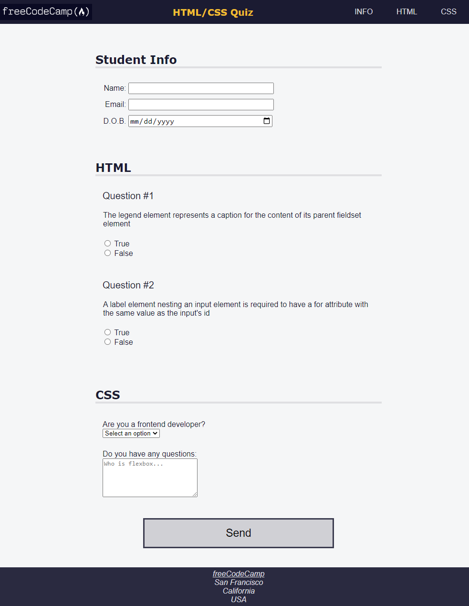

# FCC BUILDING A QUIZ

> A Building a Quiz webpage using accessibility tools such as keyboard shortcuts, ARIA atributes,
> and design best practices.



## Built With

- HTML5 Properties,
  `header`, `img`, `nav`, `ul`, `li`,
  `form`, `section`, `h1`, `h2`, `label`
  `input`, `fieldset`, `legend` etc.

- CSS Properties,
  `body; `background`, `font-family`,

header;
`width`, `height`, `background-color`, `justify-color`
`align-item`, `position`.

#logo;
`width`, `background-color`, `padding`
`aspect-ratio`.

nav > ul > li:hover,
`background-color`, `color` `cursor`

.info;
`padding`

.info label {
``width`, `min-width`
`text-align`

.question-block;
`text-align`,`display`,`width`, `margin-top`,
`padding-top`

- Linters
- [Prettier](https://prettier.io/),
- [Stylelint](https://stylelint.io/).
- GitHub Action

## Live Demo

[Live Demo Link](https://building-a-quiz-project-oladele.netlify.app/)

### Development (Running locally)

- Clone the project

```bash
git clone git@github.com:olayinka-oladele/Building-a-quiz.git

```

- Install Dependencies

```bash
yarn install
```

To run StyleLint by itself, you may run the lint task:

```bash
yarn lint:check
```

Or to automatically fix issues found (where possible):

```bash
yarn lint
```

You can also check against Prettier:

```bash
yarn format:check
```

and to have it fix (to the best of its ability) any format issues, run:

```bash
yarn format
```

You can also check against Webhint:

```bash
yarn hint
```

## Style Guides

- [CSS Style Guide](http://udacity.github.io/frontend-nanodegree-styleguide/css.html)
- [HTML Style Guide](http://udacity.github.io/frontend-nanodegree-styleguide/index.html)
- [JavaScript Style Guide](http://udacity.github.io/frontend-nanodegree-styleguide/javascript.html)
- [Git Style Guide](https://udacity.github.io/git-styleguide/)

## 👤 Author

- Github: [@olayinka-oladele](https://github.com/olayinka-oladele)
- Freecodecamp: [@olayinka-oladele](https://freecodecamp.com/author)
- Linkedin: [@olayinka-oladele](https://www.linkedin.com/in/author/)

## 🤝 Contributing

Contributions, issues and feature requests are welcome!

Feel free to check the [issues page](../../issues).

## Show your support

Give a ⭐️ if you like this project!

## Acknowledgments

- [freecodecamp](https://www.freecodecamp.org/learn/2022/responsive-web-design/learn-accessibility-by-building-a-quiz/step-68)

## 📝 License

[MIT licensed](./LICENSE).
